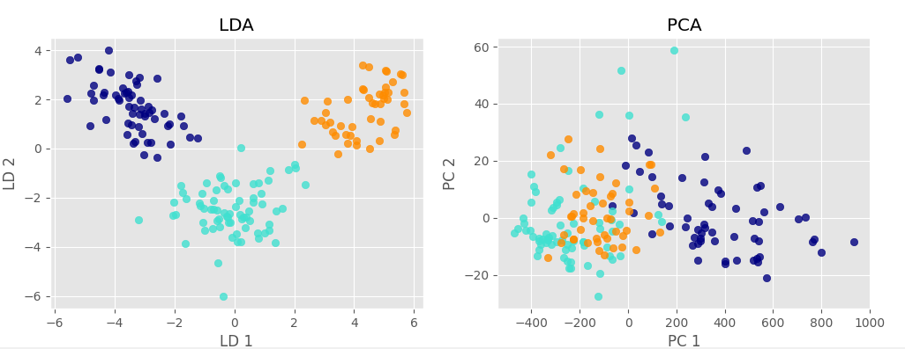

# LDA_PCA_Comparison
## Principal Component Analysis vs. Linear Discriminant Analysis
Both Linear Discriminant Analysis (LDA) and Principal Component Analysis (PCA) are linear transformation techniques that are commonly used for dimensionality reduction. PCA can be described as an “unsupervised” algorithm, since it “ignores” class labels and its goal is to find the directions (the so-called principal components) that maximize the variance in a dataset. In contrast to PCA, LDA is “supervised” and computes the directions (“linear discriminants”) that will represent the axes that that maximize the separation between multiple classes.
Read more [here](https://sebastianraschka.com/Articles/2014_python_lda.html) 
 
 
